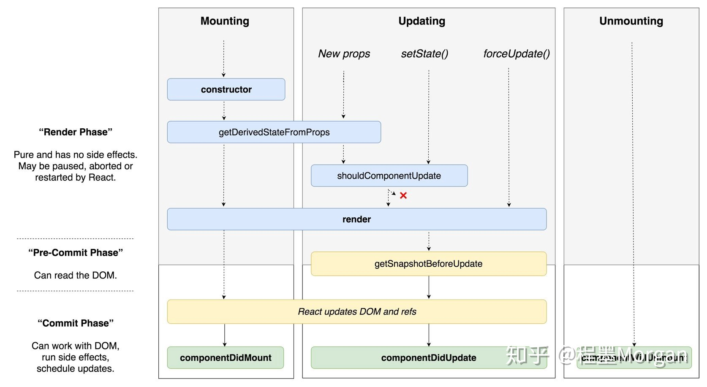

# 生命周期



## 概览

### 装配

- constructor()
- static getDerivedStateFromProps()
- render()
- componentDidMount()

### 更新

- static getDerivedStateFromProps()
- shouldComponentUpdate()
- render()
- getSnapshotBeforeUpdate()
- componentDidUpdate()

### 卸载

- componentWillUnmount()

## constructor()

正常只有在两种情况下会使用 constructor

- 初始化组件中的 state
- 绑定事件处理实例

```js
constructor(props) {
  // 否则在constructor中 this.props 将会是undefined
  super(props);

  // 不要在 constuctor 中调用 this.state()
  this.state = { counter: 0 };

  // 不要这样做
  // 你可以直接使用 this.prop.color
  // 更新 props.color 将不会映射到state中
  this.state = { color: props.color };

  // 但是其实可以用来初始化默认值
  this.state = { color: props.defaultColor }

  this.handleClick = this.handleClick.bind(this);
}
```

## render()

返回值类型

- React element （JSX）
- String and Number (被渲染为 DOM 中的 text node)
- Boolean or null (什么都不渲染)
- Array 和 [fragments](https://reactjs.org/docs/fragments.html)

  ```js
  render() {
    return [
      <li key="A">First item</li>,
      <li key="B">Second item</li>,
      <li key="C">Third item</li>,
    ];
  }
  ```

  ```js
  render() {
    return
      <React.Fragment>
        <li key="A">First item</li>,
        <li key="B">Second item</li>,
        <li key="C">Third item</li>,
      </React.Fragment>
  }
  ```

- [Portals](https://reactjs.org/docs/portals.html) ⭐️

## static getDerivedStateFromProps()

用这个之前你可能需要先看下 [你可能不需要 DerivedState](https://reactjs.org/blog/2018/06/07/you-probably-dont-need-derived-state.html)

```js
static getDerivedStateFromProps(nextProps, prevState)
```

- 返回一个对象来更新状态，或者返回 `null` 来表明新属性不需要更新任何状态。
- 调用 this.setState() 通常不会触发 getDerivedStateFromProps()。
- 如果父组件导致了组件的重新渲染，即使属性没有更新，这一方法也会被调用。如果你只想处理变化，你可能需要比较新旧值。
- 这个方法无法拿到组件实例（方法中的`this`为`undefined`）

::: tip

- 如果需要产生一个副作用以响应 `props` 中的变化（例如处理请求数据、动画），使用 `componentDidMount()`
- 如果当 `props` 改变时，改变你想重新计算数据，使用 [memoization](https://reactjs.org/blog/2018/06/07/you-probably-dont-need-derived-state.html#what-about-memoization)
- 如果当 `props` 改变时，想重新设置某些状态，考虑使用[fully controlled](https://reactjs.org/blog/2018/06/07/you-probably-dont-need-derived-state.html#recommendation-fully-controlled-component) 或者 [fully uncontrolled with a key](https://reactjs.org/blog/2018/06/07/you-probably-dont-need-derived-state.html#recommendation-fully-uncontrolled-component-with-a-key)
  :::

## componentDidMount()

- 适合用于发起网络请求
- 发起订阅的好地方，记得在 **componentWillUnmount()** 退订
- 在这个地方调用 **this.setState()** 将会触发一次额外的渲染，但是它将在浏览器刷新屏幕之前发生。这保证了即使 render()将会调用两次，但用户不会看到中间状态。它对于像模态框和工具提示框这样的例子是必须的。这时，在渲染依赖 DOM 节点的尺寸或者位置的视图前，你需要先测量这些节点。 ⭐️

## getSnapshotBeforeUpdate()

```js
getSnapshotBeforeUpdate(prevProps, prevState);
```

- 在最新的渲染输出提交给 DOM 前将会立即调用
- 从 DOM 中捕获一些信息（例如：滚动条位置）
- 返回值将传给 `componentDidUpdate()` 的第三个参数

## componentDidUpdate()

```js
componentDidUpdate(prevProps, prevState, snapshot);
```

- **componentDidUpdate()** 会在更新发生后立即被调用。**该方法并不会在初始化渲染时调用。**
- 操作 DOM；发送请求（要比较当前和之前的属性，如果属性没有改变请求也就没有必要）
- 调用 **this.setState()** 必须包裹在条件判断下，不然会导致死循环
- snapshot 为 **getSnapshotBeforeUpdate()** 中的返回值，否则为 `undefined`
- 如果 **shouldComponentUpdate()** 返回值为 false 时 **componentDidUpdate()** 将不会被调用

## componentWillUnmount()

- 在组件被卸载和销毁之前立刻调用。
- 处理任何必要的清理工作（解绑定时器，取消网络请求，清理任何在 componentDidMount 环节创建的 DOM 元素）
